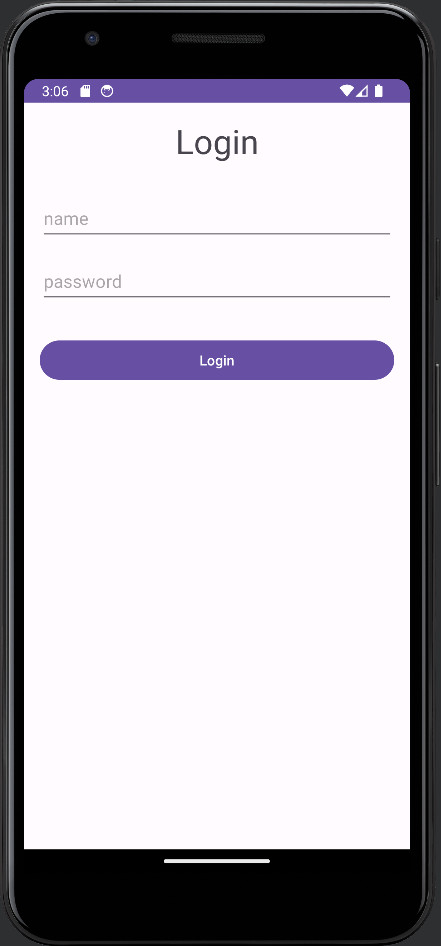

# AgendaJava

> 🧾 Projeto Agenda   

Projeto de agenda criado com a linguagem Java na IDE Android Studio e SQLite.

## 💻 - Tecnologias que utilizei:

- JAVA
- SQLite
- XML
- Android Studio.

## 🤓 O que aprendi:

- Boas praticas na utilização dos arquivos .xml utilizados na estruturação da aparência e armazenamento de recursos
- Boas praticas de códigos JAVA para mobile.
- Criação e manutenção de banco de dados SQLite.
- Manuseio do Android Studio.

## 📩 Meu contato:

- alveslucasw@gmail.com
